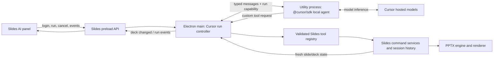

# Cursor Slides architecture

## Why this is a separate backend

The existing Slides AI panel runs a renderer-side agent loop from
`@genoffice/agent-core`, sends raw model requests through `ai:stream`, and
executes its tool definitions through a renderer `DeckAccess`. Current app
settings normalize that model path to Genspark, and whole-slide generation
uses Genspark cloud page generation.

The Cursor SDK already owns an agent, a run, streaming events, cancellation,
workspace settings, and custom-tool orchestration. Treating it as another
`AiProviderId` would create two nested agent loops and would not remove the
Genspark-specific generation path. The Cursor integration is therefore an
`AgentBackend`, parallel to the current renderer agent, while both backends
ultimately call the same Slides command services.

## Target topology



No renderer imports `@cursor/sdk`. The worker cannot access a Slides session
directly. The PPTX engine never depends on Cursor.

## Component responsibilities

### Slides renderer and preload

- Reuse the current AI panel presentation where practical, but select an agent
  backend rather than pretending Cursor is a raw model provider.
- Render login state, account-aware model choices, streamed run events, skill
  choice, cancellation, errors, and updated slides.
- Expose only typed Cursor IPC methods/events from the preload.
- Never receive, store, or log Cursor API keys.

### Electron main run controller

- Own worker lifecycle, authentication requests, model catalog caching, run
  cancellation, timeouts, and renderer event routing.
- Capture the initiating `webContents.id`, session object, and a fresh opaque
  capability when a run begins. Never retarget a run to whichever window is
  focused later.
- Reject a tool request if its worker, capability, run, renderer, or session is
  no longer current.
- Validate all inputs and call extracted Slides command services.
- Begin and end one existing history batch per run and settle it on every
  terminal path.

### Cursor utility process

- Run `@cursor/sdk` in local mode under Electron's Node-capable utility process.
- Perform browser-login coordination, model discovery, agent creation,
  streaming, and cancellation.
- Register only the custom Slides tools supplied for that run.
- Send tool requests to the parent and await typed responses.
- Store SDK agent state in a bounded JSONL location below
  `<userData>/cursor-sdk-store`; never inside the repository.
- Have no Electron renderer or arbitrary document-path capability.

### Slides command services

The large handlers in `apps/slides/src/main/slides-main.ts` currently combine
session lookup, validation, mutation, history, and IPC response shaping. Cursor
must not duplicate those mutations. Extract small service functions that take
an explicit `Session` and validated operation, then let both existing IPC
handlers and the Cursor registry call them.

The main process remains the source of truth, as established in
`apps/slides/src/main/session-state.ts`.

## Planned code boundaries

Names may change during the worker spike, but responsibilities must remain
separate:

```text
packages/cursor-agent/
├── src/protocol.ts              # parent/worker discriminated message schemas
├── src/worker.ts                # SDK lifecycle, runs, stream, custom tools
├── src/tool-contracts.ts        # portable JSON-schema tool definitions
└── tests/

apps/slides/src/main/cursor/
├── cursor-worker-client.ts      # utilityProcess lifecycle and request routing
├── cursor-run-controller.ts     # session pinning, history, cancellation
├── cursor-tool-registry.ts      # main-side validation and command calls
└── cursor-ipc.ts                # renderer-facing IPC registration

apps/slides/src/main/commands/
├── deck-read-service.ts         # bounded outline and slide inspection
├── element-command-service.ts   # text/shape operations shared with IPC
└── diagram-command-service.ts   # bounded SmartArt/native diagram operation

apps/slides/src/shared/
└── cursor-ipc.ts                # renderer IPC types, never credentials
```

The package build must emit a standalone worker entry. Do not rely on
electron-vite following the SDK's lazy imports inside the shell main bundle.

## Parent/worker protocol

Use discriminated, versioned messages with runtime validation on both sides.
Minimum message families are:

- parent to worker: `initialize`, `auth.login`, `auth.status`, `auth.logout`,
  `models.list`, `run.start`, `run.cancel`, `shutdown`, `tool.result`
- worker to parent: `ready`, `auth.result`, `models.result`, `run.event`,
  `run.terminal`, `tool.request`, `worker.error`

Every request has a unique request ID. Run and tool messages also carry a run
ID and opaque capability. Tool results match exactly one pending request.
Unknown message versions, types, IDs, duplicate terminals, and late messages
are rejected. Timeouts clear pending promises and terminate or recycle an
unresponsive worker.

The protocol must contain JSON-like data only. It never contains a file path,
raw PPTX bytes, credentials, Electron objects, or callable values.

## Initial tool surface

<!-- markdownlint-disable MD013 -->

| Tool               | Mutation | Initial bounds                                                                |
| ------------------ | -------- | ----------------------------------------------------------------------------- |
| `get_deck_context` | No       | Current pinned deck only; capped outline/text and element count               |
| `read_slide`       | No       | One existing zero-based slide index; capped text/elements                     |
| `set_element_text` | Yes      | Existing editable text ID; capped paragraphs/runs/characters and style values |
| `add_text_box`     | Yes      | Existing slide; finite in-canvas geometry; capped text                        |
| `add_shape`        | Yes      | Small preset allowlist; finite in-canvas geometry; validated colors/text      |
| `add_diagram`      | Yes      | Supported layout enum; 2-8 bounded text nodes; finite optional geometry       |

<!-- markdownlint-enable MD013 -->

The worker may perform lightweight schema validation for quick feedback. The
main registry repeats validation, enforces session ownership and call budgets,
and is the only authority that may mutate a deck.

Do not expose the existing unrestricted-looking tool collection wholesale.
In particular, the current `generate_deck` and `regenerate_slide` tools call
Genspark cloud generation, while `execute_slide_script` has a separate
security model that is unnecessary for the first Cursor slice.

## Run and history lifecycle

1. Renderer starts a run for its current deck.
2. Main captures the exact session and calls `beginHistoryBatch(session)`.
3. Worker sends zero or more custom tool requests.
4. Main validates and executes each mutation with normal `pushHistory`
   behavior, then sends fresh rendered state to the initiating renderer.
5. On success, cancellation, error, renderer destruction, session replacement,
   or worker exit, main ends or settles the batch exactly once.
6. If real edits occurred, the batch becomes one undo entry and may register
   an AI snapshot using the existing history helpers.

The run controller owns cleanup in a single `finally` path. Starting another
run or changing focus must not overwrite that ownership.

## Cursor security configuration

The official SDK documentation states that local agents run unsandboxed and
headless tool calls are approved by default. Custom tools are local-only and
skip interactive approval. The worker must therefore fail closed:

- Use local mode only. Cloud mode cannot host `local.customTools` and is not an
  acceptable document-editing fallback.
- Enable `local.sandboxOptions.enabled`.
- Use `tools: ["mcp"]`, because the SDK exposes custom tools through its MCP
  capability. `tools: []` also disables custom tools and is not the desired
  configuration. Do not configure any other built-in capability.
- Omit `mcpServers` and `local.settingSources`; register only the private
  `local.customTools` map. The worker spike must prove this offers no ambient
  MCP server or built-in shell, file edit/write, web, or task/subagent tool.
  Startup fails if that isolation cannot be demonstrated.
- Do not load broad `user`, `team`, `mdm`, or `plugins` setting sources for a
  document run.
- Treat auto-review as defense in depth, never as the authorization boundary.
- Keep network policy limited to Cursor endpoints required by login and model
  inference. Custom document tools themselves make no network calls.
- Apply main-side schemas, bounds, per-run tool-call budgets, rate limits, and
  stale-session checks regardless of SDK behavior.
- Reapply `tools: ["mcp"]` and the private custom-tool configuration when
  resuming an agent because SDK tool restrictions are not persisted.

## Authentication and models

`Cursor.auth.login()` can mint and store a user API key but does not reuse a
credential merely because Cursor Editor is installed. The worker initiates
login, passes the URL to Electron main for safe external opening, and keeps
credential storage outside the renderer and Git. Supply a dedicated SDK
credential store below the personal app's `userData` path rather than using
the default shared `~/.cursor/sdk/auth.json` location.

Use `Cursor.models.list()` and persist a selected catalog ID plus valid
parameters. Revalidate it on startup/login. If Grok or another desired model
is available to the user's current account, it can be selected; otherwise the
UI offers the current catalog or an explicit Cursor Router fallback.

## Skill compatibility and trust

Cursor can scan workspace rules and skills, but enabling SDK project settings
could also load project MCP servers, hooks, rules, or subagents. The MVP does
not use that scan and keeps `local.settingSources` omitted for skill runs.
Instead, GenOffice owns a managed skill catalog below its personal profile:

1. Select a candidate `SKILL.md` through an explicit user action.
2. Validate path containment, symlinks, byte limits, metadata, and declared
   requirements; show the source and compatibility result.
3. Copy the approved instruction file and explicitly supported text assets
   into the managed catalog with a content hash. Ignore `.cursor` settings,
   executables, hooks, MCP definitions, agent definitions, and undeclared
   files.
4. Read the bounded approved instructions through the GenOffice loader and
   inject them as a labeled section of the run's system instructions. Do not
   ask the SDK to discover project or user skills.
5. Keep `tools: ["mcp"]`, the same private `local.customTools`, no
   `mcpServers`, and no `local.settingSources` regardless of skill content.

A familiar Cursor Editor skill is compatible only if its required files and
instructions are present and it can complete with the exposed Slides tools.
Skills that assume IDE file editing, shell commands, browser control, image
generation, scripts, or unlisted assets need an explicit adapter and are not
silently granted those capabilities. The first MVP skill should be
instruction-only after adaptation.

## Packaging boundary

The SDK requires Node.js 22.13 or later, loads runtime chunks lazily, and ships
per-platform native helper packages. Development runs the unbundled worker.
Before personal packaging:

- copy the compiled worker and required SDK dependency tree outside
  `app.asar` using an explicit `extraResources`/unpack strategy;
- include the matching `@cursor/sdk-<os>-<arch>` package next to the worker;
- use the normal unbundled `@cursor/sdk` entry so its runtime dependency tree
  remains explicit; do not switch to `@cursor/sdk/bundled` without a new
  packaging decision and smoke test;
- verify the SDK sandbox on every packaged architecture;
- keep the separate application identity from ADR 0001; and
- leave the official GenOffice update feed unset.

## External technical references

- [Cursor TypeScript SDK documentation](https://cursor.com/docs/sdk/typescript)
- [Electron utility process documentation](https://www.electronjs.org/docs/latest/api/utility-process)
